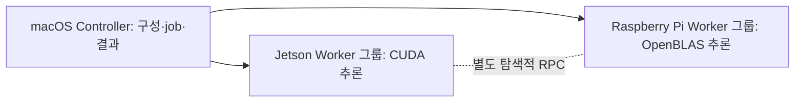

# LLM Cluster Benchmark

macOS Controller가 NVIDIA Jetson 및 Raspberry Pi Worker를 관리하고, 재현 가능한
LLM benchmark를 실행·보존·비교하는 프로젝트입니다. Controller는 inference
participant가 아니며 GGUF 모델이나 CUDA/OpenBLAS runtime을 로드하지 않습니다.

여러 장치에서 같은 모델을 비교할 때 설정·실패·측정 경고를 결과와 함께 보존해야
재현 가능한 해석이 가능합니다. Controller는 Worker 등록, 실험 구성, durable
job과 결과 조회를 맡고, 실제 GGUF 추론은 플랫폼별 Worker가 수행합니다.
기본 비교는 Jetson끼리 또는 Raspberry Pi끼리 진행하며, 혼합 장치 RPC는
별도의 탐색적 경로입니다.

| 단계 | 확인된 상태 | 근거와 한계 |
|---|---|---|
| 구현 | Worker 관리, 여러 전략, 결과·실패 보존, 분석/export 도구 | [운영 가이드](docs/operations-and-research-guide.md) |
| 과거 실장비 | 2026-08-21 Jetson 3대 + Pi 3대 기능 검증 기록 | [6 Worker acceptance](docs/refactor/hardware-six-worker-acceptance-20260821.md); 현재 장비 상태 아님 |
| Pilot v5 | 29 attempts 중 28 successful observations, 실패 1건 보존 | [당시 결정](docs/roadmap/phase-09-pilot-experiment.md); 현재 소스·runtime 승인 아님 |
| 후속 Pilot | v6는 13 completed에서 중단; Pi-only v7은 22 attempts 중 19 completed이나 `freeze_ready=false` | [현재 gate](docs/research/formal-gate-reconciliation.md), [H01](docs/followups/sweep-context-model-rpc/H01-report.md) |
| Formal | `formal_execution_allowed=false`; 1,080 runs는 계획량 | [matrix](config/research/formal_experiment_matrix.json) |

v5 이후 측정·admission 소스가 바뀌어 현재 소스 pilot 재검증과 runtime/source
re-lock이 필요합니다. Pi-only v7은 Jetson 증거를 대체하지 못하고 실패율·요청 성공률
조건도 충족하지 못했습니다. Formal 결과나 장치 간 최종 성능 순위는 아직 없습니다.



`replicated_round_robin`은 각 Worker에 전체 모델을 복제해 요청을 분배합니다.
`model_parallel_rpc`는 한 모델 계산을 여러 Worker가 나누는 별도 전략입니다.
Broadcast의 `physical_cluster_tokens_per_s`에는 복제 응답이 모두 들어가므로
고유 사용자 처리량은 `effective_user_tokens_per_s`와
`logical_requests_per_s`로 해석합니다. 상세 조건과 결측 전력 처리 기준은
[운영·연구 해석 가이드](docs/operations-and-research-guide.md)에 있습니다.

제품 안의 AI는 Worker의 GGUF 로컬 추론입니다. 개발 과정에서 AI 도구가 어떤
설계·코드·검증을 보조했는지와 개인별 기여는 브랜치명만으로 확정하지 않습니다.
[포트폴리오 설명](docs/portfolio/overview.md)과
[증거·캡처 목록](docs/portfolio/evidence.md)에 확인 가능한 범위와 필요한
본인 확인 항목을 분리했습니다. 실제 데이터에 연결된 공개 가능 화면은 아직
README에 삽입하지 않았습니다.

## Controller quick start

Controller는 Python 3.10 이상이 필요합니다. Node.js/Playwright는 개발용
브라우저 검사와 일부 PNG export에 필요하며 일반 Dashboard 시작 조건은 아닙니다.

```bash
git clone https://github.com/Phjrab/llm-cluster-benchmark
cd llm-cluster-benchmark
./scripts/setup-controller
llm-cluster start
llm-cluster status
```

Dashboard 기본 주소는 `http://127.0.0.1:8080/`입니다.
`setup-controller`가 `~/.local/bin` 링크와 셸 PATH 안내를 만듭니다. 기존
터미널에서 `llm-cluster`를 찾지 못하면 새 셸을 열거나
`export PATH="$HOME/.local/bin:$PATH"`를 실행하세요.

```bash
llm-cluster logs
llm-cluster restart
llm-cluster stop
```

`llm-cluster`는 로컬 Dashboard만 관리합니다. 원격 Worker 제어 및 점검은 다음
호환 CLI에서 수행합니다.

```bash
python -m cluster.clusterctl --help
```

## Worker setup

프로젝트를 각 Jetson 또는 Raspberry Pi에 배포한 뒤 Worker에서 실행합니다.

```bash
./scripts/setup-worker
```

시스템 패키지는 고정 allowlist와 passwordless `sudo -n` 조건에서만 자동 설치하고,
Python/inference 패키지는 프로젝트의 `.venv`에 설치합니다. Jetson은 CUDA,
Raspberry Pi 5는 OpenBLAS backend를 검증하며 pinned native llama.cpp RPC runtime도
준비합니다.

## Documentation

- [Cluster operation guide](cluster/README.md)
- [Operations and research interpretation guide](docs/operations-and-research-guide.md)
- [Security policy](SECURITY.md)
- [Contributing and test guide](CONTRIBUTING.md)
- [Refactor and acceptance reports](docs/refactor/)
- [Formal experiment identity lock](docs/research/experiment-identity-lock.md)
- [Formal gate reconciliation](docs/research/formal-gate-reconciliation.md)
- [Locked research configuration](config/research/)
- [Model Library direct-download and RPC-large manual test](docs/manual/model-library-download-and-rpc-large-test.md)

## License

이 프로젝트는 [Apache License 2.0](LICENSE)으로 배포됩니다.

과거 단일 Jetson benchmark, standalone chat server, notebook, plotting script 및
historical output은 현재 제품 트리에서 제거되었습니다. 삭제 전 내용과 커밋은 Git
history에 보존되며 history rewrite 없이 복구할 수 있습니다.
