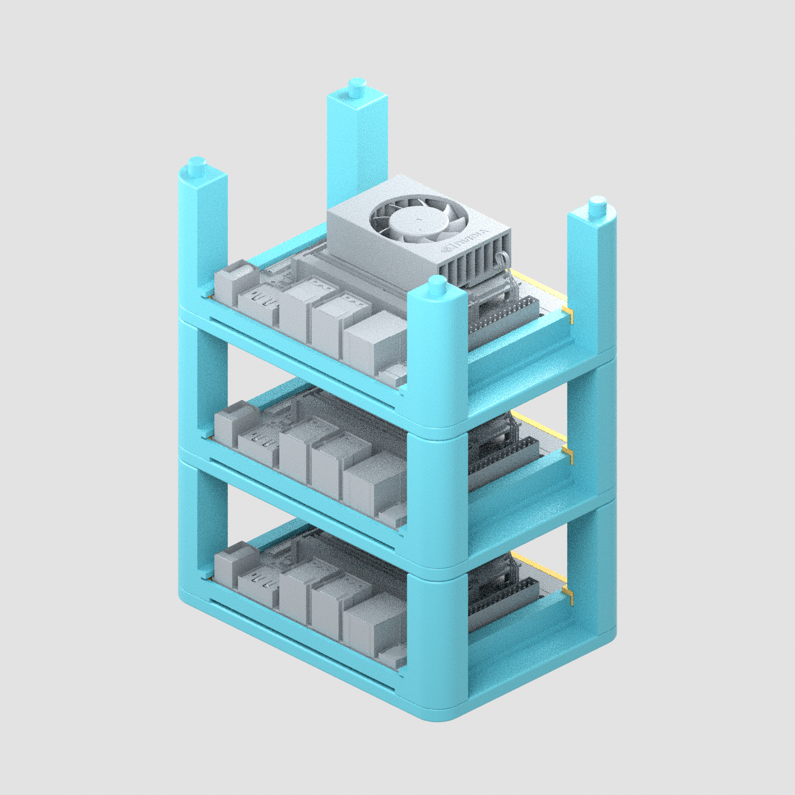
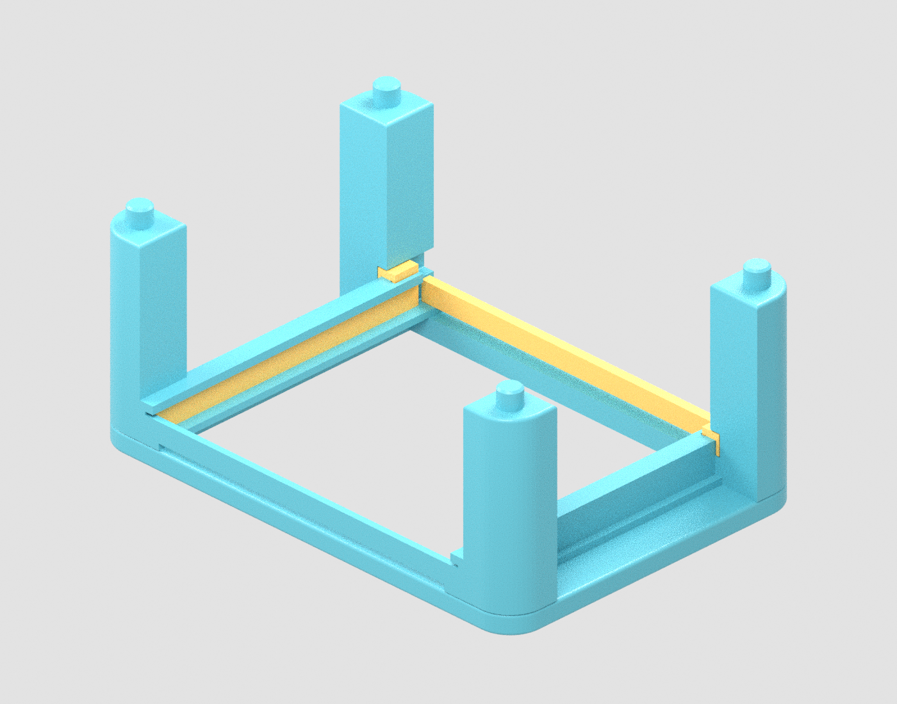

# Compact Jetson Orin Nano stack case v3

Current compact revision: **142 × 100 mm** frame, preserving the 142 mm width while reducing front/back depth from 132 to 100 mm. Rounded rear-post service channels correct the v2 centering-guide installation obstruction. Start with [Korean fabrication/assembly notes](README_assembly_ko.txt).

## Files and verification
- [Editable public FreeCAD model](public-export/JetsonOrinNano_CompactStack_v3_Public.FCStd): native parameters, feature history and fabricated assembly; no imported NVIDIA full-kit geometry
- `01_*` through `07_*`: seven fabricated part/coupon outputs in STEP/STL
- `three_level_enclosure_assembly.step/.stl`: 12-solid enclosure assembly; assembly STL is a reference, not a single fused printable object
- `service_path_validation.json`: guide, gate, board and tier installation/removal checks on the stated CAD paths
- `validation_report.json`: solid/intersection/export checks
- `native_reopen_validation.json`, public-native final reopen report: core reopen/recompute and parameter tests
- [Matching v3 PLA study](pla-study/README.md): exact final frame geometry and separate assumption-bound screening; FEM is not assembly proof
- `PUBLICATION_MANIFEST.json`: exact published files, sizes and hashes

Frame STEP SHA-256 is `4b03f9d8fd696466c35360a9d7859cf208a581c82649890b3845c1cf844603bb`, matching the v3 study. Public native SHA-256 is `5fb8963ae123f15563261683e2512f2af4943f4fd07163fd4f22a8a521792604`.

Guide installation/removal uses the verified endwise route through the rear-post service channels. CAD path checks do not certify real printer tolerances, friction or hardware fit. The native core file reopened/recomputed and Pitch61→60 parameter test passed; appearance metadata was preserved, but final GUI visual reopening was not verified after the cloud FreeCAD GUI exited. The seven included preview images are CAD renders of final geometry, not GUI screenshots or physical-hardware photographs.

## Prototype limitations and vendor reference
**Not physically printed, fitted, load tested or thermally certified.** Print relevant fit coupons first and confirm actual stock guard, antennas, cables, guides, seating surfaces and printer tolerances. Three-tier gravity stacking requires external restraint; transport, vibration, robot movement, tip resistance, retention and long-term creep remain unverified.

The public native retains the owned parametric design and omits unlicensed external NVIDIA reference shapes. [Official reference source and placement instructions](public-export/EXTERNAL_REFERENCE.md) are linked separately. No private reference native, PRIVATE_* contact files, raw preview meshes, backups, scratch helpers or solver binaries are included. Contextual renders may show the kit only as attributed illustration, not vendor endorsement.

Historical v2 remains available with a prominent do-not-print notice because its guide installation path was not validated. Use this v3 folder for the compact design; do not apply v2 FEM results to it.

## Final-geometry CAD renders

These were rendered from the final FreeCAD geometry and checked for framing. They do not verify physical fit or final GUI visual reopening. NVIDIA reference in context images is attributed illustration only; its raw full-kit CAD is not redistributed.

- [Single tier with contextual kit](cad-renders/single-level-with-kit.png)
- [Rear guide-service channels](cad-renders/rear-guide-service-channels.png)
- [I/O alignment](cad-renders/io-alignment-top.png)
- [Underside guard and antennas](cad-renders/underside-stock-guard-and-antennas.png)
- [Fit coupons](cad-renders/fit-coupons-preview.png)
- [Preview validation](cad-renders/preview_validation.json)
