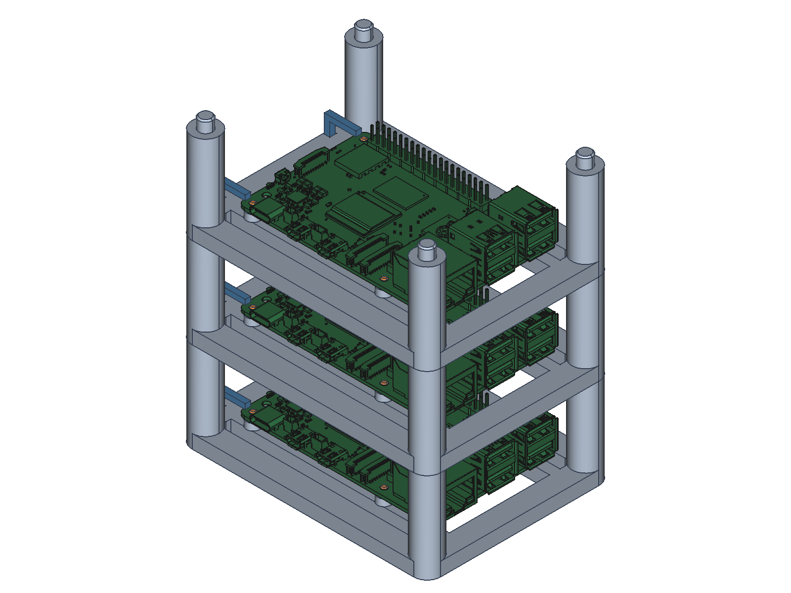
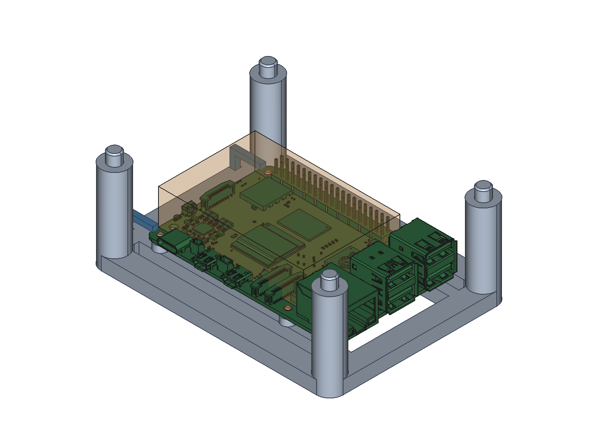

# Raspberry Pi 5 active-cooler stack prototype v1

Editable native FreeCAD model, eight printable frame/pin/keeper/fit-coupon outputs in STEP/STL, a three-tier structure STEP, assembly previews, geometric validation and reference license.

Start with [Korean assembly notes](README-ko.md). Print the full four-pin pattern coupons and stack-joint coupons first. Do not force pins through PCB mounting holes. Board dimensions and hole positions use the official Raspberry Pi reference; the active-cooler envelope and assembly clearances include assumptions that must be confirmed against the actual cooler, cables and hardware.

**CAD prototype only. Not physically printed, fitted, thermally validated or mechanically load tested.** Three-tier gravity stacking needs independent restraint and is unsuitable for transport, vibration or robot movement without a separately verified retention design.

The native file includes official Raspberry Pi 5 reference geometry redistributed under its MIT license. Keep [the complete reference notice and guidance-only disclaimer](RaspberryPi-reference-LICENSE.txt) with that file. Manufacturing exports contain the designed frame and hardware, not a dump of external vendor assets. Preview PNGs are FreeCAD CAD views, not photographs or evidence of hardware testing.

See `PUBLICATION_MANIFEST.json` for exact file byte counts, SHA-256 and Git blob SHA-1. Temporary build/repair logs, autosaves and redundant ZIP copies are excluded. This addition does not change the benchmark application.

## FreeCAD CAD previews

These previews show the modeled geometry. Orange translucent shapes indicate assumed active-cooler clearance envelopes, not a detailed cooler model. Physical fit, loading and cooling remain untested.

- [Single-tier four-pin frame](single-tier-four-pin-frame.png)
- [Three-tier assumed cooler clearance](three-tier-assumed-cooler-keepout.png)
